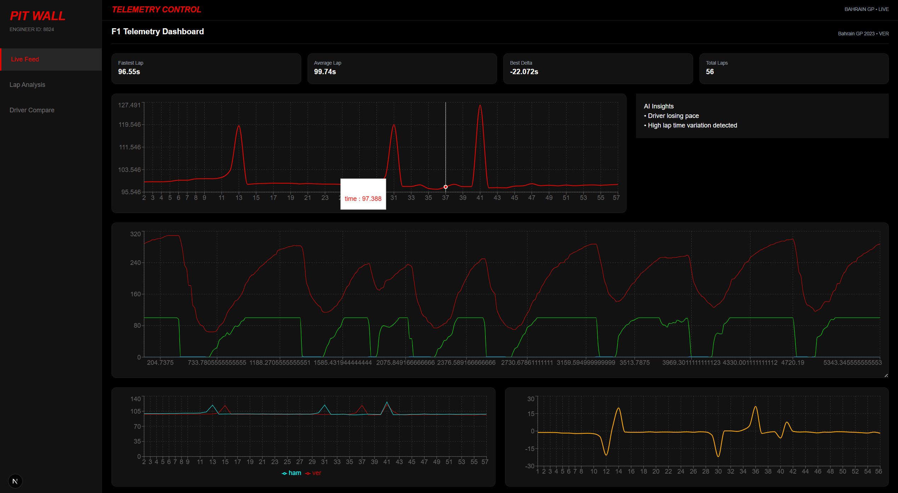

# 🏎️ F1 Telemetry AI Dashboard

An AI-powered Formula 1 telemetry analysis platform that visualizes race data and provides intelligent insights into driver performance.

---

## 🚀 Features

- 📊 Lap Time Analysis
- ⚡ Telemetry Visualization (Speed, Throttle, Brake)
- 🏁 Driver Comparison (VER vs HAM)
- 📉 Delta Gap Analysis
- 🧠 AI-Based Insights (rule-based, extendable to LLMs)
- 📱 Responsive & Adaptive UI (resizable charts)

---

## 🧠 Tech Stack

### Frontend
- Next.js (App Router)
- Tailwind CSS
- Recharts

### Backend
- FastAPI
- Python

### Data
- FastF1 API (offline cached dataset)

---

## 🏗️ Architecture
FastF1 Data
    ↓
Data Processing (Python)
    ↓
FastAPI Backend
    ↓
Next.js Frontend
    ↓
Charts + AI Insights
---

## 📂 Project Structure

f1-telemetry-ai/
│
├── backend/
│   └── main.py
│
├── data/
│   ├── laps.json
│   ├── telemetry.json
│   ├── laps_VER.json
│   └── laps_HAM.json
│
├── frontend/
│   └── app/
│       ├── components/
│       └── page.tsx
│
└── generate_data.py
---

## ⚙️ Setup Instructions

### 1. Backend

```bash
pip install fastapi uvicorn fastf1
uvicorn backend.main:app --reload

### 2. Generate Data

```bash
python generate_data.py

### 3. Frontend

```bash
cd frontend
npm install
npm run dev

Screenshots

